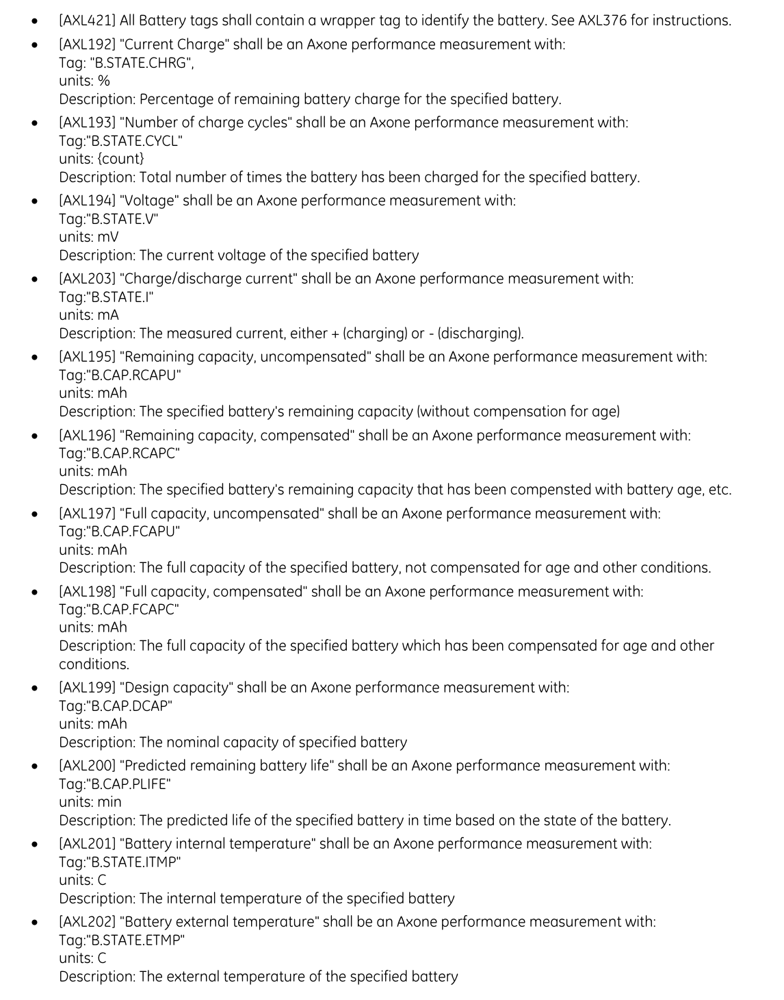

This is an [R Markdown](http://rmarkdown.rstudio.com) Notebook. When you execute code within the notebook, the results appear beneath the code. 

When you save the notebook, an HTML file containing the code and output will be saved alongside it (click the *Preview* button or press *Cmd+Shift+K* to preview the HTML file). 

The preview shows you a rendered HTML copy of the contents of the editor. Consequently, unlike *Knit*, *Preview* does not run any R code chunks. Instead, the output of the chunk when it was last run in the editor is displayed.

Package Installation:
  - If this is the first time you are running this Rmd file and you do not have the dplyr, jsonlite, ggplot2, tidyr, lubridate library installed, uncomment the first four line and run the R chunk.
  - Remember to comment out the first five line again after you have installed dplyr, jsonlite, ggplot2, tidyr, lubridate into your RStudio environment.

```{r}
# install.packages("dplyr")
# install.packages("ggplot2")
# install.packages("jsonlite")
# install.packages("tidyr")
# install.packages("lubridate")
library(dplyr)
library(ggplot2)
library(jsonlite)
library(tidyr)
library(lubridate)
```

## Processing Raw Data File(Filtering and Expanding)

Load the log file into a dataframe and preview the columns available:

```{r}
orig_data = read.csv("2022-09-27T06-00-00.000_2022-09-27T06-59-59.999.csv")
names(orig_data)
```

Removing unneeded information in dataframe by filter the columns from the log data:

```{r}
df = orig_data %>%
  select(-c("processCounter", "concentrationCounter", "logLevel", "processInfo", "sourceInfo"))
head(df)
```

The eventCategory classifies whether a log is a general(General) log, performance log(PerfData), or user action log(UserAction). For battery analysis we are currently only interested in performance data.

This is a frequency distribution of each log type:

```{r}
ggplot(df, aes(x = eventCategory)) +
  geom_bar()
  labs(title = "Frequency of Event Categories", x = "Event Categories", y = "Frequency")
```

There are a significant amount of general logs that will be unnecessary for battery analysis. When storing this information in a database, we can save space by removing a lot of these logs.

Filtering down logs to performance data only:

```{r}
filtered_df = df %>%
  filter(eventCategory == "PerfData")
head(filtered_df)
```

```{r}
cat("Number of logs in unfiltered log file:", nrow(df), "\n")
cat("Number of logs in filtered log file:", nrow(filtered_df), "\n")
```

The "description" data/column in the log file has strings that can be converted to JSONs. The code below checks that all strings can be converted into as JSON. It collects the strings that can not be converted into JSON.

```{r}
failed_indices <- c()

for (i in 1:length(filtered_df$description)) {
  tryCatch({
    parsed_json <- jsonlite::parse_json(filtered_df$description[i])
  }, error = function(e) {
    failed_indices <- c(failed_indices, i)
  })
}

cat("Number of strings that can not be converted to JSON:", length(failed_indices))
```

Each JSON contains a single key-value pair, where the value is an array. To code below ensures that no unexpected behavior is found, by checking the keys of each JSON in the description columns only contains the key "PerfData"
.
```{r}
filtered_df$description <- lapply(filtered_df$description, jsonlite::parse_json)

json_objects <- filtered_df$description

all_keys <- unlist(lapply(json_objects, names))

unique_keys <- unique(all_keys)
cat("Keys in JSONs:", unique_keys)
```

The PerfData key holds an array of JSONs that contain battery log information needed for this analysis. The dataframe needs to be expanded for each JSON in the array.

```{r}
filtered_df$PerfData <- lapply(filtered_df$description, function(json) {
  return(json$PerfData)
})
head(filtered_df)
```

The eventCategory and description are no longer needed so filter these out:

```{r}
filtered_df = filtered_df %>%
  select(-c("description", "eventCategory"))

head(filtered_df)
```

Each entry in the PerfData list holds a single statistic relating to one battery. Example: (battery: SPO2 Sensor has a charge of 3700). The code below expands the dataframe for each of these statistics:

```{r}

unnested_df <- unnest(filtered_df, PerfData)
head(unnested_df)

```

Check the number of key-value pairs for each statistic relating to one battery log.

```{r}

list_lengths <- lengths(unnested_df$PerfData)
unique(list_lengths)

```

There are varying lengths for each statistic logged. Not all of them are related to batteries. A battery statistic is indicated by the presence of a B in the key.

Ex. B.STATE.I, B.STATE.ETMP, B.STAT.CHRG, etc.

Filtering out non-battery statistics:

```{r}

rows_to_remove <- logical(nrow(unnested_df))

for (i in seq_along(unnested_df$PerfData)) {
  keys <- names(unnested_df$PerfData[[i]])
  
  if (any(grepl("^B\\.", keys))) {
    rows_to_remove[i] <- FALSE
  } else {
    rows_to_remove[i] <- TRUE
  }
}

unnested_df <- unnested_df[!rows_to_remove, ]

```

Check the lengths for each battery statistic logged:

```{r}

list_lengths <- lengths(unnested_df$PerfData)
unique(list_lengths)

```

All of the battery statistics have a length of 3, which confirms that the logged statistics are battery related.

According to the Axone Logging Interface Spec:
[AXL376] resource: (optional, based on tag) is the name of the resource being monitored. The types of resource
would be as follows:

"battery:hardwareIdentifier", where the hardwareIdentifier can be "HUB", "SPO2SENSOR", and "RESPSENSOR"

This explains that there are three types of hardwareIdentifiers(types of batteries): "HUB", "SPO2SENSOR", and "RESPSENSOR". The code below identifies the hardwareIdentifier of the battery.

```{r}

extract_identifier <- function(json_data) {
  resource_value <- json_data$resource
  identifier <- sub("^battery:", "", resource_value)
  return(identifier)
}

unnested_df$hardwareIdentifier <- sapply(unnested_df$PerfData, extract_identifier)

head(unnested_df)

```

Confirming that only three hardwareIdentifiers exist in the dataframe:

```{r}

unique(unnested_df$hardwareIdentifier)

```

The three hardwareIdentifiers found in every log in the dataframe is as specified in the Axone Logging Interface Spec.

Next, the harder challenge of expanding other relevant information related to battery logs:



The following is taken from the Axone Logging Interface Spec. which shows the types of battery state information that may be found in the logs. 

First a column for the time stamps will be added. 

```{r}

extract_timestamp <- function(json_data) {
  timestamp <- json_data$timestamp
  return(timestamp)
}

unnested_df$timestamp <- sapply(unnested_df$PerfData, extract_timestamp)

head(unnested_df)

```

The code below removes the timestamp and resource key from the PerfData JSONs as this makes the process of extracting the final key-value pair easier. The key of the last JSON is unknown as it varies depending on the tag that was explained in the Axone Logging Interface Spec.

```{r}

remove_keys <- function(json_data) {
  json_data$timestamp <- NULL 
  json_data$resource <- NULL 
  return(json_data)
}

unnested_df$PerfData <- lapply(unnested_df$PerfData, remove_keys)

key_value_pairs <- sapply(unnested_df$PerfData, function(json_obj) unlist(json_obj))

unnested_df$PerfData_Key <- names(key_value_pairs)
unnested_df$PerfData_Value <- unlist(key_value_pairs)

```

The final key-value pair left in the PerfData JSON that needs to be extracted is the battery statistic itself(B.STATE.I, B.STATE.ETMP, B.STAT.CHRG, etc.). The key will vary dependent on the tag that was provided in the Axone Logging Interface Specs above. The value will be an integer in the units specified in the documentation.

```{r}

key_value_pairs <- sapply(unnested_df$PerfData, function(json_obj) unlist(json_obj))
unnested_df$PerfData_Key <- names(key_value_pairs)
unnested_df$PerfData_Value <- unlist(key_value_pairs)

head(unnested_df)

```

The PerfData column has been processed into individual columns so it can be removed, which is done in the code below. The new dataframe has now processed the JSON from the raw excel format and filtered down to only instances of battery statistics. In the next few transformation of the dataframe, individual battery statistics will be associated with single batteries.

```{r}

processed_df = unnested_df %>%
  select(-c("PerfData"))

head(processed_df)

```


## Associating Battery Statistics to individual Battery Log Instances

Before transforming the dataframe into Battery Log Instances, further analysis about the different hardwareIdentfiers must be analyzed. The goal of this section is to identify the different types/tags of statistics that are collected for each type of hardwareIdentfier.

```{r}

hardware_df <- processed_df[, c("hardwareIdentifier", "PerfData_Key")]

hardware_df <- hardware_df %>%
  group_by(hardwareIdentifier, PerfData_Key) %>%
  summarise(Count = n())

head(hardware_df)

```

Plotting the different statistics recorded by the logs for each type of hardwareIdentifier:

```{r}

unique_hardware_identifiers <- unique(hardware_df$hardwareIdentifier)

for (hardware_id in unique_hardware_identifiers) {
  subset_df <- hardware_df %>% filter(hardwareIdentifier == hardware_id)
  
  p <- ggplot(subset_df, aes(x = PerfData_Key, y = Count)) +
    geom_bar(stat = "identity", fill = "skyblue") +
    labs(title = paste("Frequency of PerfData_Key Values for", hardware_id),
         x = "PerfData_Key",
         y = "Frequency (Count)") +
    theme_minimal() +
    theme(axis.text.x = element_text(angle = 45, hjust = 1))
  
  print(p)
}


```

Apparently, the same four stats are recorded for each battery instance(B.STATE.CHRG, B.STATE.ETMP, B.STATE.I, and B.STATE.V). These will now become four more columns for each log of a battery instance. To identify battery instances a groupby is necessary based on the following columns: timeStampAndOffset, hostName, sourceUUID, friendlyName, hardwareIdentifier, and timestamp. Then the value of the PerfData_Key determines which column the associated value will go in.

```{r}

instance_df = processed_df %>%
  group_by(timeStampAndOffset, hostName, sourceUUID, friendlyName, hardwareIdentifier, timestamp) %>%
  pivot_wider(names_from = PerfData_Key, values_from = PerfData_Value)

head(instance_df)

```

This seems to have put each instance in a list. The integer values are extracted from the list in the code section below:

```{r}

extract_integer <- function(x) {
  ifelse(length(x) == 0, NA_integer_, as.integer(x[[1]]))
}

instance_df <- instance_df %>%
  mutate(across(c(B.STATE.V, B.STATE.I, B.STATE.ETMP, B.STATE.CHRG), 
                ~ sapply(., extract_integer)))

head(instance_df)

```

According to the Axone Logging Interface Spec states that the timestamp: is the actual time the measurements where taken and may not be the same values as the "Datestamp+Timestamp". 

```{r}

instance_df$timestamp <- as.POSIXct(instance_df$timestamp, format = "%Y-%m-%dT%H:%M:%OS")

instance_df$year <- year(instance_df$timestamp)
instance_df$month <- month(instance_df$timestamp)
instance_df$day <- day(instance_df$timestamp)
instance_df$hour <- hour(instance_df$timestamp)
instance_df$minute <- minute(instance_df$timestamp)
instance_df$second <- second(instance_df$timestamp)
instance_df$millisecond <- round(as.numeric(format(instance_df$timestamp, "%OS3")), 3) 
instance_df$timezone <- tz(instance_df$timestamp)

head(instance_df)

```

## Conclusion

This concludes the data transformation. Here are some notes for future parsing and data cleaning:

1. **Associating Battery Statistics to Individual Battery Log Instances:**
   - The last section needs further testing.
   - Future tests may include:
     - Comparing the `processed_df` and its original values with the values stored in the `instance_df` for corresponding tag-value pairs.
     - Confirming the process of interpreting log data with the same `timeStampAndOffset`, `hostName`, `sourceUUID`, `friendlyName`, `hardwareIdentifier`, and `timestamp` as battery statistics that come from the same battery instance.
     - Evaluating the NA values in the tag columns (`B.STATE.V`, `B.STATE.I`, `B.STATE.ETMP`, `B.STATE.CHRG`).

2. **For Further Analysis, Machine Learning, and Storing in Database Structures:**
   - The code can be moved to an RScript.
   - Dataframes built can be accessed directly through Python.
   - This means no intermediary files are needed to move transformed data between programs.
   - This allows R to serve as a first error checking mechanism in case any unexpected behavior is detected.
   - R is programmed in C and is optimized to work with dataframes.
   - Further time analysis must be done to compare log data processing done by an RScript and one done straight through programs built in languages like Python.
   
   
## Data Analysis

Identifying the number of Hubs in the Log Data using hostname and source UUID:

```{r}

unique(instance_df$hostName)
unique(instance_df$sourceUUID)

```

There are 8 hubs in this system and it can be established that there are no discrepancy between the hostname and source UUID. The code chunk below visualizes the number of battery instances associated with each Hub:

```{r}

frequency_table <- table(instance_df$hostName)

frequency_df <- as.data.frame(frequency_table)

colnames(frequency_df) <- c("hostName", "Frequency")

ggplot(frequency_df, aes(x = hostName, y = Frequency)) +
  geom_bar(stat = "identity", fill = "blue") +
  labs(title = "Frequency Histogram of hostName", x = "hostName", y = "Frequency") +
  theme_minimal()

```

The start of this analysis will be based on the hostName with the most battery instances:

```{r}

max_frequency_index <- which.max(frequency_df$Frequency)
most_frequent_host <- frequency_df$hostName[max_frequency_index]
print(most_frequent_host)

```

For evaluation of hostName: 44-4b-5d-01-04-21, a couple of assumptions will be established. Hopefully, these assumptions will become less strict as the analysis progresses. 

### Assumptions

- Each host has 2 RESPSENSOR and 2 SPO2SENSOR and 1 HUB battery.
- These batteries do not move around between hosts.
- Batteries cannot be uniquely identified. Future inference on voltage, current, etc. trends will hopefully show a system that can uniquely identify these batteries.


Plotting HUB batteries voltage for hostname: 44-4b-5d-01-04-21, under the assumption that only 1 exists for this hostname. If such assumptions can be treated truthfully, the trend should follow consistently.
  
```{r}

host_hub_instances <- instance_df %>%
  filter(hostName == "44-4b-5d-01-04-21", hardwareIdentifier == "HUB")

host_hub_instances$timestamp <- as.POSIXct(host_hub_instances$timestamp)

ggplot(host_hub_instances, aes(x = timestamp, y = B.STATE.V)) +
  geom_point() + 
  labs(x = "Timestamp", y = "Voltage") +
  ggtitle("Voltage vs Timestamp")

```

The plot shows unexpected behavior from plotting the voltages of the HUB battery over the timestamps. This could be caused by the fact that the previous assumption that there is only HUB battery associated with each host is incorrect. A closer look into the data reveals a possible fix to the strange pattern shown above.

```{r}

head(host_hub_instances, 25)

```

Notice that for rows with a NA in one of the columns(B.STATE.V, B.STATE.I, B.STATE.ETMP, and B.STATE.CHRG), the row below it has a non-NA value for the same column. Moreover, the timestamp associated with both these rows are exactly the same. It is possible, that when logging the information, statistics relating to the same battery were placed in two separate PerfData JSONs.

The code below checks whether the number of non-NA values in each column(B.STATE.V, B.STATE.I, B.STATE.ETMP, and B.STATE.CHRG) is equal. Then it checks whether there are not more than 1 consecutive NA values within one column.

```{r}

cat("Number of non-NAs in B.STATE.V:",sum(!is.na(host_hub_instances$B.STATE.V)), "\n")
cat("Number of non-NAs in B.STATE.I:",sum(!is.na(host_hub_instances$B.STATE.I)), "\n")
cat("Number of non-NAs in B.STATE.ETMP:",sum(!is.na(host_hub_instances$B.STATE.ETMP)), "\n")
cat("Number of non-NAs in B.STATE.CHRG:",sum(!is.na(host_hub_instances$B.STATE.CHRG)), "\n")

has_consecutive_nas <- function(x) {
  any(with(rle(is.na(x)), lengths > 1))
}

cat("Does B.STATE.V have consecutive NAs:",has_consecutive_nas(host_hub_instances$B.STATE.V), "\n")
cat("Does B.STATE.I have consecutive NAs:",has_consecutive_nas(host_hub_instances$B.STATE.I), "\n")
cat("Does B.STATE.ETMP have consecutive NAs:",has_consecutive_nas(host_hub_instances$B.STATE.ETMP), "\n")
cat("Does B.STATE.CHRG have consecutive NAs:",has_consecutive_nas(host_hub_instances$B.STATE.CHRG), "\n")

```
The number of B.STATE.ETMP recordings is 1 less than the others. Each column has consecutive NAs. This is a problem! 

NOTE: FURTHER ANALYSIS OF CONSECUTIVE NAs SHOULD BE DONE

For now, an additional step to parsing could be added by merging the columns with the same timestamps. The code below does this:

```{r}

host_hub_clean <- host_hub_instances %>%
  select(timestamp, B.STATE.V, B.STATE.I, B.STATE.ETMP, B.STATE.CHRG) %>%
  group_by(timestamp) %>%
  summarise(
    B.STATE.V = ifelse(all(is.na(B.STATE.V)), NA, first(na.omit(B.STATE.V))),
    B.STATE.I = ifelse(all(is.na(B.STATE.I)), NA, first(na.omit(B.STATE.I))),
    B.STATE.ETMP = ifelse(all(is.na(B.STATE.ETMP)), NA, first(na.omit(B.STATE.ETMP))),
    B.STATE.CHRG = ifelse(all(is.na(B.STATE.CHRG)), NA, first(na.omit(B.STATE.CHRG)))
  ) %>%
  ungroup()

head(host_hub_clean)
  
```

Plotting time against voltage for the HUB batteries again:

```{r}

ggplot(host_hub_clean, aes(x = timestamp, y = B.STATE.V)) +
  geom_point() + 
  labs(x = "Timestamp", y = "Voltage") +
  ggtitle("Voltage vs Timestamp")

```

Welp....not sure how to explain this one tbh.